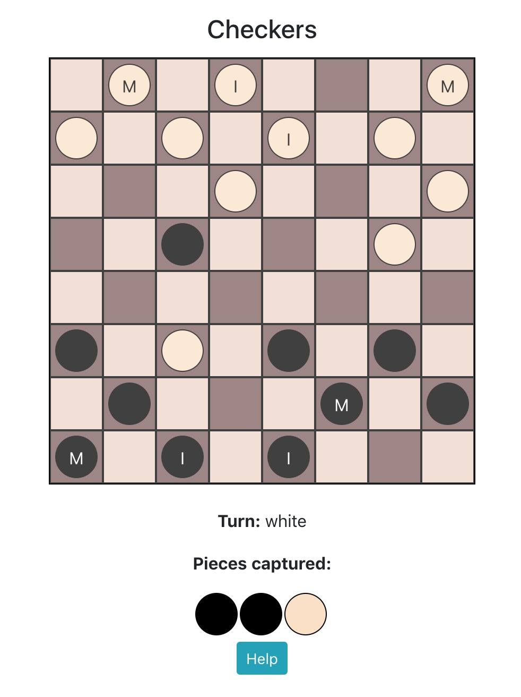

# Checkers

Play checkers locally with two special pieces.

<li><b>Imposter Pieces</b> are special pieces that become a King Piece upon capturing another piece. Imposter Pieces are marked with I.</li>
<li><b>Medic Pieces</b> are special pieces that upon reaching the last row, restores a captured piece to the starting row if available, and then becomes a King Piece. Medic Pieces are marked with M.</li>

## To Play Locally
1. Clone this repo
2. yarn install
3. yarn start